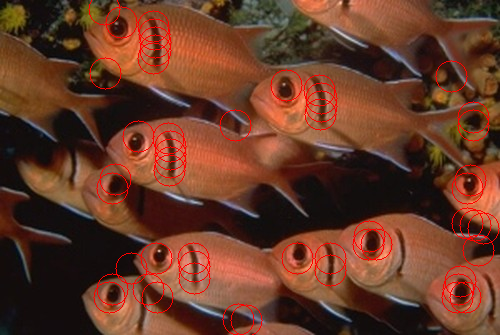

# Blob-Detection
Simple blob detection algorithm implemented through a 1-level laplacian scale space. Additional filtering to exclude neighboring maxima. 

## Example Images

Format: 

Format: 

.png)
Format: 

Format: 
